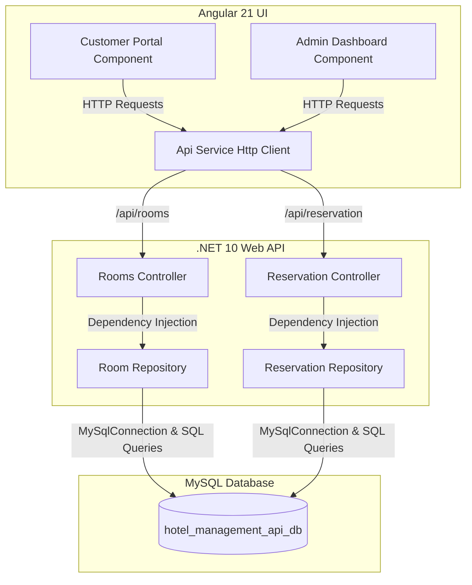
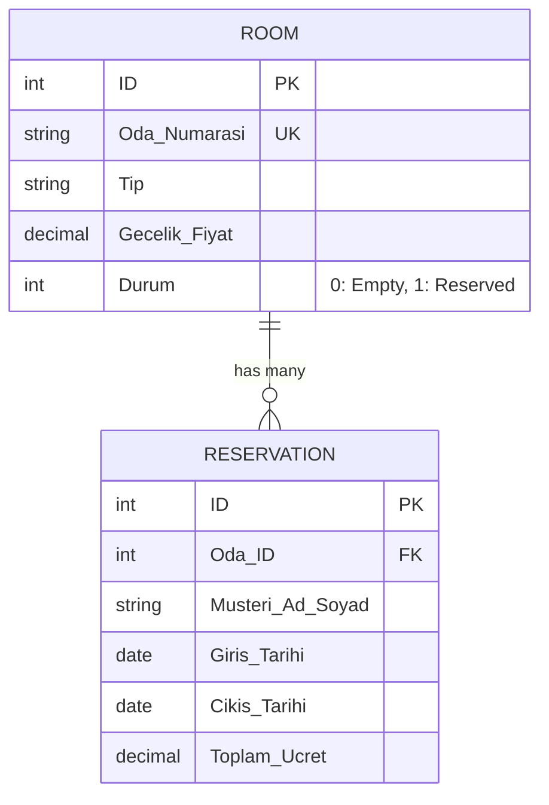

# 🏨 Hotel Management System (Otel Yönetim Sistemi)

A full-stack, enterprise-ready **Hotel Management System** built with a modern **.NET 10 Web API** backend and a responsive **Angular 21** frontend. The system provides seamless online room reservations for customers and a comprehensive administrative management dashboard for hotel staff.

---

## 🚀 Key Features

### 👤 Customer Portal (`/customer`)
- **Real-Time Room Availability Search**: Filter available rooms by specifying check-in and check-out dates.
- **Instant Price Calculation**: Automatic total price computation based on total nights stayed and nightly room rates.
- **Online Reservation Booking**: Guests can easily select rooms and complete bookings by submitting their personal details.
- **Validation & Date Constraints**: Built-in validation preventing booking past dates or invalid check-out ranges.

### 🛡️ Admin Management Dashboard (`/admin`)
- **Room Management (CRUD)**:
  - **Create**: Add new hotel rooms with room numbers, room types (Single, Double, Suite, etc.), and nightly prices.
  - **Update (New)**: Edit existing room details (`Oda Numarası`, `Tip`, and `Gecelik Fiyat`) via an interactive Pop-up Modal.
  - **Delete**: Remove rooms from the system.
- **Occupancy Protection (`durum === 1`) (New)**:
  - Rooms currently reserved (`durum === 1`) are protected against accidental updates or deletions.
  - Action buttons (`Güncelle` and `Odayı Sil`) are automatically **disabled** and **faded** (`opacity: 0.45`, `pointer-events: none`).
- **Reservation Oversight**: View all active and historical bookings complete with customer names, assigned rooms, stay dates, and total charges.
- **Booking Cancellation**: Instantly cancel or remove customer reservations.
- **Availability Monitoring**: Search and verify room availability directly from the admin workspace.
- **Modern Pop-up UI & Error Handling (New)**:
  - **Glassmorphism Backdrop Blur**: Pop-up dialogs with blurred backdrops (`backdrop-filter: blur(6px)`).
  - **Smooth CSS Animations**: Entrance keyframe scaling and slide animations (`animate-popup`).
  - **Custom Error Alert Modal**: Reusable pop-up dialog for friendly error notification displays.

---

## 🛠️ Technology Stack

| Layer | Technology / Framework | Key Packages & Tools |
|---|---|---|
| **Backend** | .NET 10 Web API (C#) | `MySql.Data` (v9.7.0), `Swashbuckle.AspNetCore` (Swagger) |
| **Frontend** | Angular 21 (Standalone Components) | TypeScript, RxJS, Angular Forms, Vitest |
| **Database** | MySQL RDBMS | Raw SQL execution via Repository Pattern |
| **API Protocol** | RESTful JSON API | Swagger OpenAPI UI, CORS enabled for Angular |

---

## 🏗️ Architecture & System Workflow

The project follows a clean **Repository Pattern** on the backend to isolate business logic from database interactions, paired with modular **Angular Standalone Components** on the frontend.



---

## 📊 Database Schema

The database relies on a relational schema with foreign key constraints and cascade rules between rooms and reservations.



### SQL Script (`Hotel_Management_db.sql`)

```sql
CREATE SCHEMA hotel_management_api_db;
USE hotel_management_api_db;

CREATE TABLE room (
  ID INT AUTO_INCREMENT PRIMARY KEY,
  Oda_Numarası VARCHAR(10) UNIQUE NOT NULL,
  Tip VARCHAR(50) NOT NULL,
  Gecelik_Fiyat DECIMAL(10,2) NOT NULL
);

CREATE TABLE reservation (
  ID INT AUTO_INCREMENT PRIMARY KEY,
  Oda_ID INT,
  Musteri_Ad_Soyad VARCHAR(100) NOT NULL,
  Giris_Tarihi DATE NOT NULL,
  Cikis_Tarihi DATE NOT NULL,
  Toplam_Ucret DECIMAL(10,2) NOT NULL,
  FOREIGN KEY (Oda_ID) REFERENCES room(ID)
);
```

---

## 📡 API Reference

### 🚪 Rooms (`/api/rooms`)

| Method | Endpoint | Description | Query / Body Params |
|---|---|---|---|
| `GET` | `/api/rooms` | Fetch list of all rooms | - |
| `GET` | `/api/rooms/available` | Get available rooms for a given date range | `checkIn` (Date), `checkOut` (Date) |
| `POST` | `/api/rooms` | Create a new room | `{ oda_Numarasi, tip, gecelik_Fiyat }` |
| `PUT` | `/api/rooms/{id}` | Update room details | `{ oda_Numarasi, tip, gecelik_Fiyat, durum }` |
| `DELETE` | `/api/rooms/{id}` | Remove a room by ID | Path variable `id` |

### 📅 Reservations (`/api/reservation`)

| Method | Endpoint | Description | Query / Body Params |
|---|---|---|---|
| `GET` | `/api/reservation` | Retrieve all reservations with room details | - |
| `POST` | `/api/reservation` | Create a new room reservation | `{ oda_ID, musteri_Ad_Soyad, giris_Tarihi, cikis_Tarihi }` |
| `DELETE` | `/api/reservation/{id}` | Delete / Cancel a reservation | Path variable `id` |

---

## 📂 Project Directory Structure

```
Hotel_Management_System/
│
├── Hotel_Management_Api/                  # .NET 10 Web API Backend Project
│   └── Hotel_Management_Api/
│       ├── Controllers/                   # API Endpoints (RoomsController, ReservationController)
│       ├── DTOs/                          # Data Transfer Objects
│       ├── Interfaces/                    # Repository Interfaces (IRoomRepository, etc.)
│       ├── Models/                        # Entity Domain Models (Room, Reservation)
│       ├── Repositories/                  # Data Access Layer using MySql.Data
│       ├── Program.cs                     # Middleware, Service Injection & CORS Config
│       └── appsettings.json               # Backend Configuration & Connection Strings
│
├── Hotel_Management_Frontend/             # Angular 21 Single-Page Application
│   └── src/app/
│       ├── components/                    # Reusable UI Components (Header, etc.)
│       ├── models/                        # TypeScript Interfaces (Room with durum property, Reservation)
│       ├── pages/                         # Main Views
│       │   ├── admin/                     # Admin Management Dashboard (with Update Modal & Error Alert)
│       │   └── customer/                  # Guest Reservation Portal
│       ├── services/                      # API Client Service (HttpClient integration)
│       ├── app.routes.ts                  # Angular Application Routing Configuration
│       └── app.config.ts                  # App Providers & HTTP Client Setup
│
└── Hotel_Management_db.sql                # Database Creation & Table Schema Script
```

---

## ⚡ Getting Started & Setup Guide

### 1. Prerequisites
Ensure you have the following software installed:
- [.NET 10.0 SDK](https://dotnet.microsoft.com/download)
- [Node.js](https://nodejs.org/) (v18+ recommended) and `npm`
- [Angular CLI](https://angular.dev/) (`npm install -g @angular/cli`)
- [MySQL Server](https://dev.mysql.com/downloads/mysql/) or MySQL Workbench / MariaDB

---

### 2. Database Setup
1. Open your MySQL client (e.g., MySQL Workbench or Command Line).
2. Execute the provided `Hotel_Management_db.sql` script to create the schema and required tables:
   ```bash
   mysql -u root -p < Hotel_Management_db.sql
   ```

---

### 3. Backend Setup (.NET Web API)
1. Navigate to the API folder:
   ```bash
   cd Hotel_Management_Api/Hotel_Management_Api
   ```
2. Configure your MySQL database connection string. Update your `appsettings.Development.json` or `.NET User Secrets`:
   ```json
   {
     "ConnectionStrings": {
       "DefaultConnection": "Server=localhost;Database=hotel_management_api_db;Uid=root;Pwd=YOUR_MYSQL_PASSWORD;"
     }
   }
   ```
3. Restore dependencies and run the API server:
   ```bash
   dotnet restore
   dotnet run
   ```
4. Access the Swagger UI for interactive API documentation:
   - **Swagger URL:** `https://localhost:7028/swagger` (or `http://localhost:5000/swagger`)

---

### 4. Frontend Setup (Angular UI)
1. Navigate to the frontend workspace directory:
   ```bash
   cd Hotel_Management_Frontend
   ```
2. Install npm dependencies:
   ```bash
   npm install
   ```
3. Launch the Angular development server:
   ```bash
   npm start
   ```
4. Open your browser and navigate to:
   - **Customer Portal:** `http://localhost:4200/customer`
   - **Admin Dashboard:** `http://localhost:4200/admin`

---

## 🧪 Testing

### Frontend Unit Tests
Run unit tests powered by **Vitest**:
```bash
cd Hotel_Management_Frontend
npm run test
```

---

## 📝 License
This project is developed for educational and internship purposes. Feel free to fork, modify, and enhance it!
